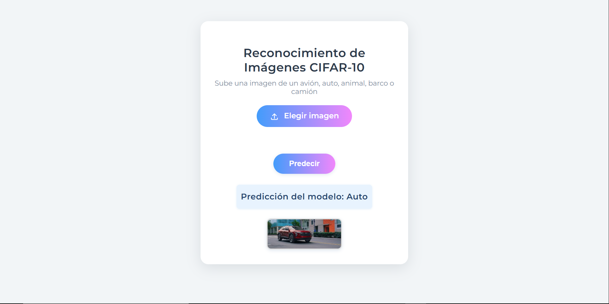

# ExtraRedDeReconocimientoDeImagenes

Reconocimiento de imágenes con redes neuronales y una aplicación web en Flask.

---

## 📚 Descripción

Este proyecto desarrolla una red neuronal para reconocer imágenes de 10 clases distintas usando el dataset CIFAR-10. La red es entrenada con imágenes y luego se integra en una aplicación web para que cualquier usuario pueda cargar una imagen y ver la predicción de la clase.

---

## 🤖 ¿Cómo funciona este proyecto como una red neuronal?

- **Entrenamiento**:  
  Utilizamos un script en Python que emplea PyTorch para construir y entrenar una red neuronal convolucional simple (`SimpleCIFAR10Net`).  
  - La red tiene capas convolucionales, funciones de activación y capas totalmente conectadas.
  - Durante el entrenamiento, la red ve miles de imágenes del dataset CIFAR-10, compara sus predicciones con la respuesta correcta (función de pérdida) y ajusta sus parámetros para mejorar.
  - Esto se realiza usando el método de propagación hacia adelante (inferencia) y propagación hacia atrás (ajuste de pesos).
  - Al finalizar, se guarda el modelo entrenado en el archivo `cifar10_simple_model.pth`.

- **Predicción (Inferencia)**:  
  En la aplicación web, cuando el usuario sube una imagen:
  1. La imagen se procesa y adapta a lo que espera la red.
  2. Se pasa por el modelo entrenado, que analiza la imagen y predice a qué clase pertenece.
  3. El resultado se muestra en la web, junto a la imagen subida.

- **Aplicación Web (Flask)**:  
  - La app permite subir imágenes desde el navegador.
  - Utiliza el modelo entrenado para hacer la predicción en tiempo real.
  - Puedes ver el resultado fácilmente.  

    

---

## 📦 Instalación de dependencias

En la terminal, dentro de la carpeta del proyecto:

```sh
pip install -r requirements.txt
```

---

## 📂 Preparar los datos

1. El archivo `cifar-10-python.tar` ya está en la carpeta `data/`.
2. Descomprime el archivo usando WinRAR, 7-Zip o con este comando:

    ```sh
    tar -xf data/cifar-10-python.tar -C data/
    ```

---

## 🚀 Cómo usar la aplicación

1. Ejecuta en el archivo app.py
   ```sh
      app.py
   ```

3. Carga una imagen desde la web para probar el reconocimiento.

---

## 🛠️ Entrenamiento del modelo (opcional)

Si deseas entrenar la red desde cero, ejecuta:

```sh
  train_cifar10_model.py
```

Esto generará un nuevo archivo `cifar10_simple_model.pth` con el modelo ajustado.

---

## 📚 Referencias

- [PyTorch](https://pytorch.org/)
- [Flask](https://flask.palletsprojects.com/)
- [Dataset CIFAR-10](https://www.cs.toronto.edu/~kriz/cifar.html)

---
